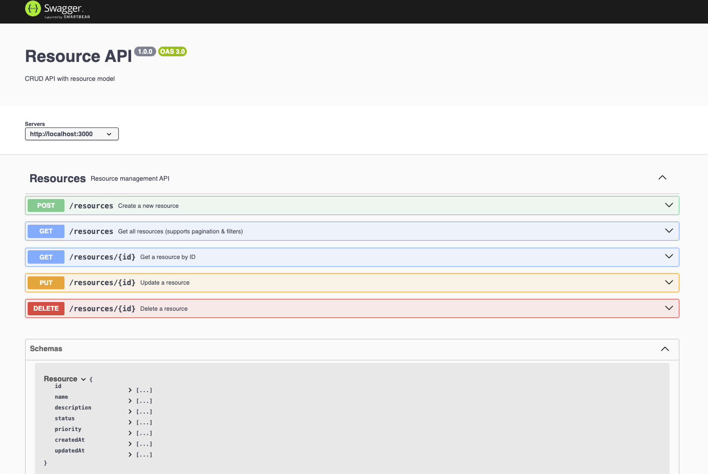
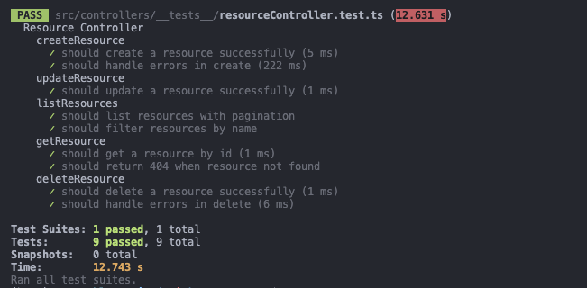

<h1 align="center">Resource Management API</h1>

# Introduction

The Resource Management API is a RESTful API designed to manage resources in a system. It provides endpoints for creating, reading, updating, and deleting resources.

# What I done?
- [x] Setup source code using ExpressJS (TypeScript)
- [x] Setup Stylelint and Eslint for code quality
- [x] Setup Prettier for code formatting
- [x] Setup Jest for unit testing
- [x] Setup Swagger for API documentation
- [x] Database Migration
- [x] CRUD Resource APIs
- [x] Unit Test

# Output





# Folders Structure

The following is a typical folder structure for implementing Clean Architecture in a NestJS application:

```
problem5/
├── prisma/
│   ├── schema.prisma        # Database schema
│   ├── migrations/          # Prisma migration files
├── src/
│   ├── controllers/
│   │   └── resourceController.ts  # CRUD logic
│   │   ├── __tests__/
│   │   │   └── resourceController.test.ts    # Unit tests
│   ├── middleware/
│   │   ├── errorHandler.ts        # Global error handling
│   │   ├── validateResource.ts    # Validation middleware
│   ├── models/
│   │   └── prismaClient.ts        # Prisma instance
│   ├── routes/
│   │   └── resourceRoutes.ts      # Express routes
│   ├── swagger.ts                 # Swagger API documentation
│   ├── types.ts                   # TypeScript types
│   ├── constants.ts               # Constants
│   ├── config.ts                  # Configuration
│   ├── app.ts                      # Main Express server

├── .env                            # Environment variables
├── .gitignore                       # Ignore unnecessary files
├── package.json                    # Dependencies and scripts
├── tsconfig.json                    # TypeScript configuration
├── README.md                        # Documentation
```
## Installation


### Install dependencies

```bash
$ pnpm install
```
### Setup .env file

```bash
$ cp .env.template .env
```

### Migrate Prisma
```bash
$ pnpm migrate
```

## Run the app

```bash
# watch mode
$ pnpm run dev
```

## URL
- http://localhost:3000/api-docs # Swagger Documentation
- http://localhost:3000 # Backend API

## Test

```bash
# unit tests
$ pnpm run test
```

