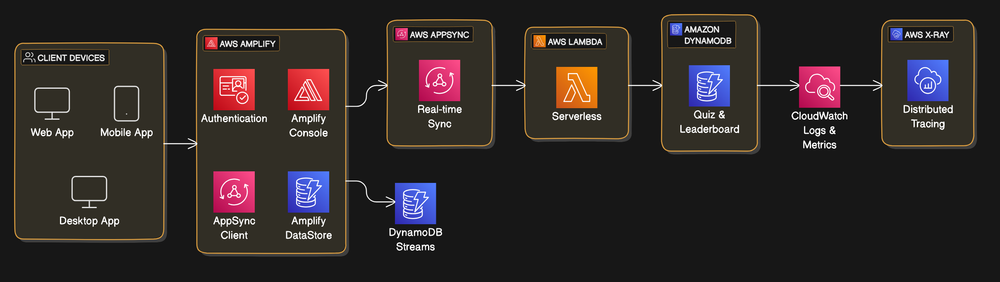
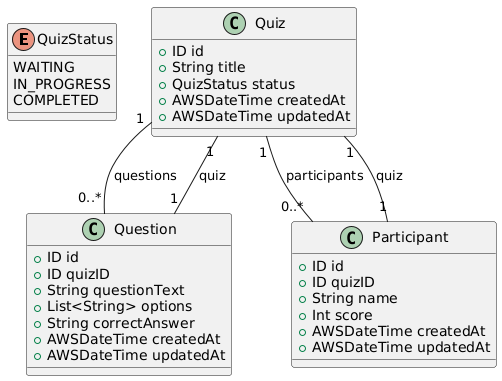
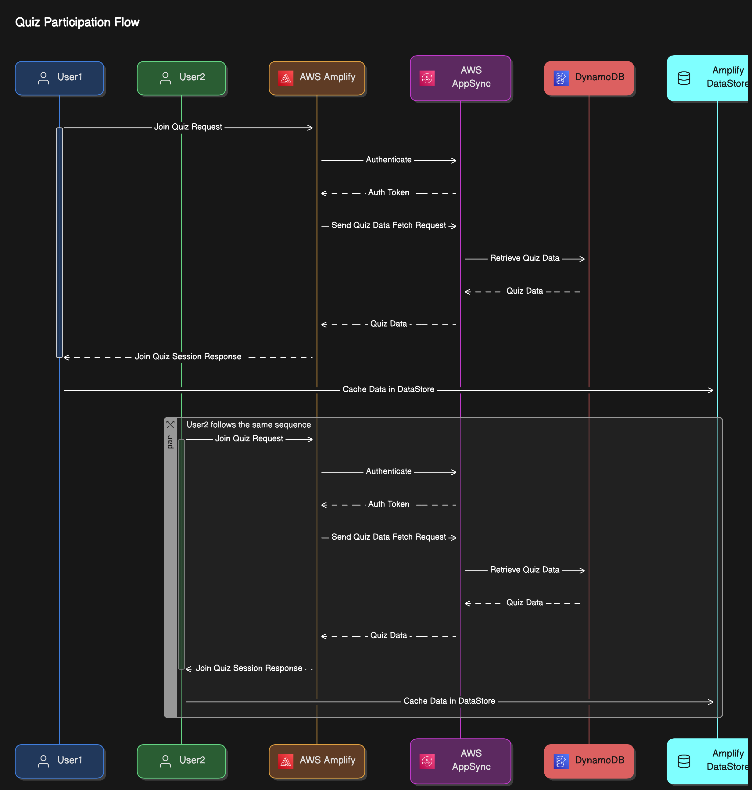
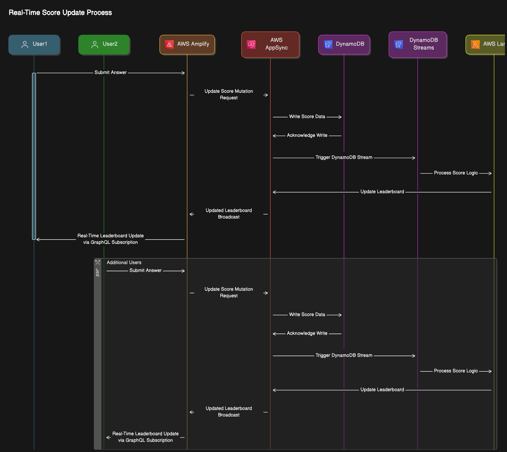

# Real-Time Quiz System Design Summary

## 1. Architecture Diagram

### Overview

This system is designed to support a scalable, real-time quiz platform where multiple users can participate in quizzes, submit answers, view scores, and observe leaderboard rankings live. By leveraging AWS’s serverless and managed services, we build a highly scalable, cost-effective, and maintainable solution tailored to handle high concurrency with minimal infrastructure management.

### Component Summary

- **Client Devices**: Web, Mobile, and Desktop interfaces for the user.
- **AWS Amplify**: Simplifies authentication, offline support, and caching. Chosen for its built-in features, which reduce development complexity and enhance user experience, especially with offline capabilities.
- **AWS AppSync**: Manages real-time data with GraphQL subscriptions, essential for instant updates on scores and leaderboard changes.
- **Amazon DynamoDB**: A NoSQL database that offers high-throughput, low-latency data handling, perfect for storing quiz and leaderboard data with minimal delay.
- **DynamoDB Streams**: Triggers updates in Lambda upon database changes.
- **AWS Lambda**: : Provides serverless backend processing for scoring and leaderboard updates. Automatically scales, making it ideal for fluctuating traffic and high-concurrency use.
- **CloudWatch Logs & Metrics**: Tracks logs and metrics across AWS services.
- **AWS X-Ray**: Provides distributed tracing for performance monitoring and troubleshooting.

### Why This Architecture?

- **Scalability**: Serverless architecture with Amplify, AppSync, and Lambda allows for automatic scaling based on user demand.
- **Real-Time Data Synchronization**: AppSync with GraphQL subscriptions enables real-time updates, providing instant feedback for users on quiz scores and leaderboard.
- **Low Maintenance**: Managed services like Amplify, AppSync, and DynamoDB reduce the need for manual server management.
- **Cost-Efficient for Smaller Scale**: Serverless, pay-as-you-go pricing can be cost-effective for applications with variable traffic.
- **Offline Support**: Amplify DataStore provides offline support and caching, enhancing user experience with intermittent connectivity.
- **Reliability**: AWS services are designed for high availability and fault tolerance, ensuring minimal downtime and consistent performance. Managed monitoring and logging help detect and resolve issues proactively.

---

## 2. Database Diagram

# Entity Descriptions

- **Quiz**: Represents a quiz with a title, current status, and timestamps for creation and updates.
- **Question**: Defines individual questions within a quiz, including question text, answer options, and the correct answer.
- **Participant**: Represents a quiz participant, tracking their name, associated quiz, and score.
- **QuizStatus**: Enum representing the quiz's status as WAITING, IN_PROGRESS, or COMPLETED.

---

## 3. Sequence Diagrams

### Flow 1: Multi-User Access to Join a Quiz Session

### Flow 2: Real-Time Score Update and Leaderboard Synchronization

## 

## 4. Pros and Cons of the Architecture

### Pros

- **Scalability**: Serverless architecture with Amplify, AppSync, and Lambda allows for automatic scaling based on user demand.
- **Real-Time Data Synchronization**: AppSync with GraphQL subscriptions enables real-time updates, providing instant feedback for users on quiz scores and leaderboard.
- **Low Maintenance**: Managed services like Amplify, AppSync, and DynamoDB reduce the need for manual server management.
- **Cost-Efficient for Smaller Scale**: Serverless, pay-as-you-go pricing can be cost-effective for applications with variable traffic.
- **Offline Support**: Amplify DataStore provides offline support and caching, enhancing user experience with intermittent connectivity.

### Cons

- **High Complexity in Setup**: The combination of Amplify, AppSync, and DynamoDB can be challenging to configure and maintain for developers new to AWS.
- **Potential Latency in Real-Time Sync**: Real-time data synchronization across distributed services can introduce latency, especially for high-frequency updates.
- **Cost Considerations at Scale**: High volumes of read/write operations in DynamoDB, combined with AppSync subscriptions, can lead to increased costs.
- **Vendor Lock-In**: Heavy reliance on AWS services may lead to vendor lock-in, making it more difficult to migrate to another cloud provider in the future.
- **Eventual Consistency**: DynamoDB’s eventual consistency model may lead to slight delays in real-time updates for concurrent high-traffic interactions.

---

## 5. Technologies and Tools

| Component             | Technology                 | Purpose                                                               |
| --------------------- | -------------------------- | --------------------------------------------------------------------- |
| Client-Side           | React, Vue.js              | Provides a responsive front end for real-time interactions            |
| Authentication        | AWS Amplify                | Manages user authentication and authorization                         |
| Real-Time Sync        | AWS AppSync                | Handles GraphQL subscriptions and real-time data synchronization      |
| Database              | Amazon DynamoDB            | Stores quiz data, questions, scores, and leaderboard information      |
| Event Handling        | DynamoDB Streams           | Triggers backend processing upon database updates                     |
| Serverless Processing | AWS Lambda                 | Processes user scores, calculates leaderboard updates                 |
| In-Memory Caching     | DynamoDB Accelerator (DAX) | Speeds up leaderboard reads to handle high concurrency                |
| Optional Caching      | Amazon ElastiCache (Redis) | Real-time caching for leaderboard data, reducing DynamoDB load        |
| Monitoring            | Amazon CloudWatch          | Tracks logs, metrics, and alerts for AWS components                   |
| Distributed Tracing   | AWS X-Ray                  | Provides tracing for monitoring and debugging application performance |

---

## 6 Security Threats & How to Prevent Them

| Security Threat | Potential Risk | Solution |
|----------------|----------------|-----------|
| Data Breach | Unauthorized access to sensitive user data and quiz content | - Implement encryption at rest and in transit - Use AWS KMS for key management - Implement proper IAM roles and policies - Regular security audits |
| DDoS Attacks | Service disruption affecting quiz availability | - Implement AWS Shield for DDoS protection - Set up rate limiting - Use CloudFront for edge protection |
| SQL Injection | Database manipulation and unauthorized data access | - Use parameterized queries - Implement input validation - Use DynamoDB's built-in security features |
| Cross-Site Scripting (XSS) | Client-side code injection affecting user experience | - Implement input sanitization - Use Content Security Policy (CSP) - Validate all user inputs |
| Insecure Direct Object References (IDOR) | Unauthorized access to resources through URL manipulation | - Implement proper access controls - Use resource-based permissions - Validate user permissions for each request |
| Insecure API Endpoints | Unauthorized API access and data manipulation | - Implement API Gateway authorization - Use AWS WAF - Implement request validation |
| Insecure Authentication | Account takeover and identity theft | - Implement MFA - Use secure session management - Implement password policies |
| Fake Actions | Manipulation of quiz results and scoring | - Implement action tokens - Server-side validation - Rate limiting for submissions |

## 7. Conclusion

This system design provides a robust and scalable foundation for a real-time quiz application, offering features such as multi-user access, real-time score updates, and leaderboard synchronization. By leveraging AWS services, the system ensures high availability, fault tolerance, and the ability to handle a large number of concurrent users.
